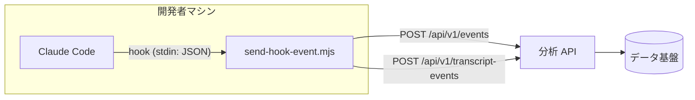

# brisys-claude-code-analytics-plugin

Claude Code の利用統計を収集し、分析基盤 (ai-analytics) に送信する Claude Code プラグインのマーケットプレイスです。

セッション・プロンプト送信・ツール使用・スキル/コマンド実行・サブエージェント・モデル別トークン使用量などのイベントを Claude Code の [hooks](https://code.claude.com/docs/en/hooks) で捕捉し、HTTP API へ送信します。

> このリポジトリは正本リポジトリ ([brisys-dev/brisys-claude-analytics-plugin](https://github.com/brisys-dev/brisys-claude-analytics-plugin), private) からの**自動同期ミラー**です。プラグイン本体への変更は正本側で行われ、main への push ごとに同期されます (README / AGENTS.md / CLAUDE.md / LICENSE を除く)。

## 構成

```
.claude-plugin/marketplace.json   # マーケットプレイス定義
claude-code-analytics/            # プラグイン本体
├── .claude-plugin/plugin.json    # プラグインマニフェスト
├── hooks/hooks.json              # hook 定義 (捕捉イベントとコマンド)
└── scripts/send-hook-event.mjs   # コレクタ (依存ゼロの Node.js スクリプト)
```

## アーキテクチャ



## 捕捉イベント

| hook イベント | 送信 event_type | 実行 | 内容 |
|---|---|---|---|
| SessionStart | `session.started` | async | セッション開始 |
| SessionEnd | `session.ended` | async | セッション終了 + transcript 解析 (トークン集計 / スキル / コマンド検出) |
| UserPromptSubmit | `message.submitted` | async | プロンプト送信 (本文は送信しない) |
| PreToolUse (Edit\|Write) | — (送信なし) | sync | 行数統計用のファイルスナップショット取得のみ |
| PostToolUse (Skill\|Agent\|EnterPlanMode\|ExitPlanMode\|mcp__.*\|Edit\|Write) | `tool.used` | sync | ツール使用 (Edit/Write は行数統計付き) |
| PostToolUseFailure (同上) | `tool.failed` | sync | ツール失敗 |
| SubagentStart | `subagent.started` | async | サブエージェント開始 |
| SubagentStop | `subagent.completed` | async | サブエージェント終了 + agent transcript 解析 |

SessionEnd / SubagentStop では transcript (JSONL) を解析し、以下を `transcript-events` として送信します。

- `transcript.token_usage` — モデル別のトークン使用量 (input / output / cache、requestId 単位で集計)
- `transcript.skill_detected` — Skill ツールの呼び出し (スキル名のみ、引数は送らない)
- `transcript.command_detected` — スラッシュコマンドの実行 (コマンド名のみ、引数は送らない)

## プライバシー — 送信されるもの / されないもの

**送信されるもの**

- イベントメタデータ (セッション ID、イベント種別、時刻、ホスト名)
- アカウント識別用の email (解決方法は後述)
- プロジェクト (git リポジトリのルートパス、なければ cwd)
- ツール名・対象ファイルパス・行数統計 (追加/削除/変更行数)
- スキル名・コマンド名 (引数の有無フラグのみ。引数の内容は送らない)
- モデル別トークン使用量

**送信されないもの**

- プロンプト本文
- 編集内容 — Edit の `old_string` / `new_string`、Write の `content` は `[REDACTED]` に置換
- アシスタントの応答本文 (`last_assistant_message`)
- ツールの実行結果 (`tool_response`)

## インストール

チームのメンバーには Team settings (managed settings) の `extraKnownMarketplaces` / `enabledPlugins` で自動配布されるため、通常は手動インストール不要です。

手動でインストールする場合は Claude Code で以下を実行します。

```
/plugin marketplace add brisys-dev/brisys-claude-code-analytics-plugin
/plugin install claude-code-analytics@brisys-claude-code-analytics-plugin
```

## 要件

- **Node.js 18 以降** — コレクタは Node.js で動作します (外部依存なし)。Node.js が無い環境では統計は送信されません (Claude Code の動作自体には影響しません)
- 分析 API のエンドポイント URL と API キー

## 設定

環境変数で設定します。シェルの設定ファイル、または Claude Code の `settings.json` の `env` セクションで指定してください。

| 環境変数 | 必須 | 説明 |
|---|---|---|
| `AI_ANALYTICS_API_URL` | ✅ | 分析 API のベース URL |
| `AI_ANALYTICS_API_KEY` | ✅ | Bearer トークン |
| `AI_ANALYTICS_USER_EMAIL` | — | email の明示指定 (自動解決を上書き) |
| `AI_ANALYTICS_PROJECT` | — | プロジェクト名の明示指定 (git root 解決を上書き) |
| `AI_ANALYTICS_STATE_DIR` | — | 行数統計用スナップショットの保存先 (デフォルト: 一時ディレクトリ) |
| `AI_ANALYTICS_DEV_API_URL` / `AI_ANALYTICS_DEV_API_KEY` | — | 開発用の上書き (通常設定より優先) |

`settings.json` での設定例:

```json
{
  "env": {
    "AI_ANALYTICS_API_URL": "https://api.example.com",
    "AI_ANALYTICS_API_KEY": "sk-team-xxxx"
  }
}
```

**フェイルセーフ**: `AI_ANALYTICS_API_URL` / `AI_ANALYTICS_API_KEY` が未設定の場合、または email が解決できない場合は何も送信せず正常終了します。送信エラーもすべて握りつぶし、Claude Code の動作をブロックしません。

### email の解決順序

1. `AI_ANALYTICS_USER_EMAIL` 環境変数
2. `~/.claude.json` の OAuth ログイン情報 (`oauthAccount.emailAddress`)
3. `git config --global user.email`

## トラブルシューティング

イベントが届かない場合:

1. `node --version` — Node.js がインストールされているか
2. `AI_ANALYTICS_API_URL` / `AI_ANALYTICS_API_KEY` が hook プロセスに渡っているか (`settings.json` の `env` 推奨)
3. email が解決できているか (上記の解決順序を確認)
4. `claude --debug hooks` で hook の実行ログを確認

## 開発

プラグイン本体の開発は正本リポジトリ ([brisys-dev/brisys-claude-analytics-plugin](https://github.com/brisys-dev/brisys-claude-analytics-plugin)) で行っています。このリポジトリで直接管理しているのは README / AGENTS.md / CLAUDE.md / LICENSE のみで、それ以外への直接コミットは次回同期で上書きされます。

- マーケットプレイス仕様: https://code.claude.com/docs/en/plugin-marketplaces.md
- 不具合報告・改善要望はこのリポジトリの [Issues](https://github.com/brisys-dev/brisys-claude-code-analytics-plugin/issues) へ
